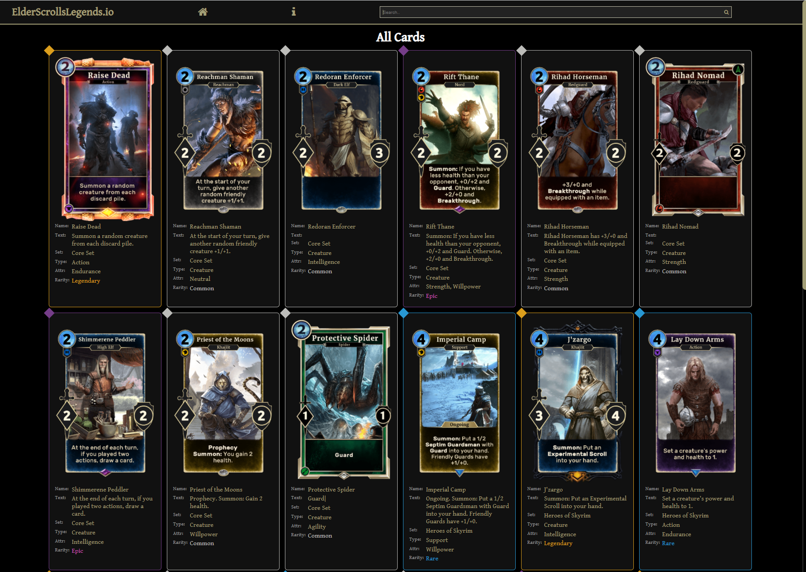

# Elder Scrolls Card Viewer

## Description

This project is a vue.js app that utilizes the public Elder Scrolls Legends API to display card images and card info.

It uses vuex to manage app state and vue router to handle page navigation.

## Live Demo

Check out the live demo here: [Live Demo](https://apnoble.github.io/elder-scrolls-card-viewer/)

## Project setup

After cloning the repo or downloading and extracting a zip of the project navigate to the project's root directory and  

run the command:
```
npm install
```

### To Run Locally with Hot Module Replacement

Execute the command
```
npm run serve
```
in the project directory then navigate to the provided local host address in your browser.


### Features to be added in later versions

* The ability to sort by card rarity and set.
* Unit testing

### Notes

More information about the API can be found at the following link: [Elder Scrolls Legends API](https://docs.elderscrollslegends.io/#documentationgetting_started)

This app was created by Alex Noble: [GitHub](https://github.com/apnoble) - [LinkedIn](https://www.linkedin.com/in/apnoble/)

Thank you!

## Screenshot of Running App

